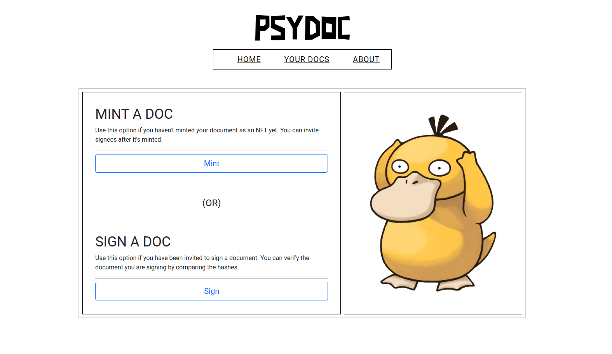
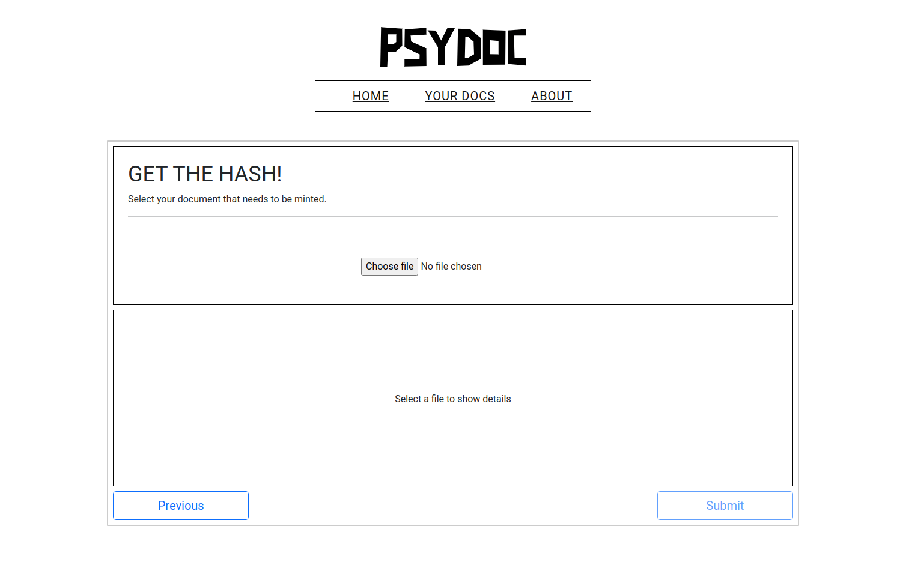
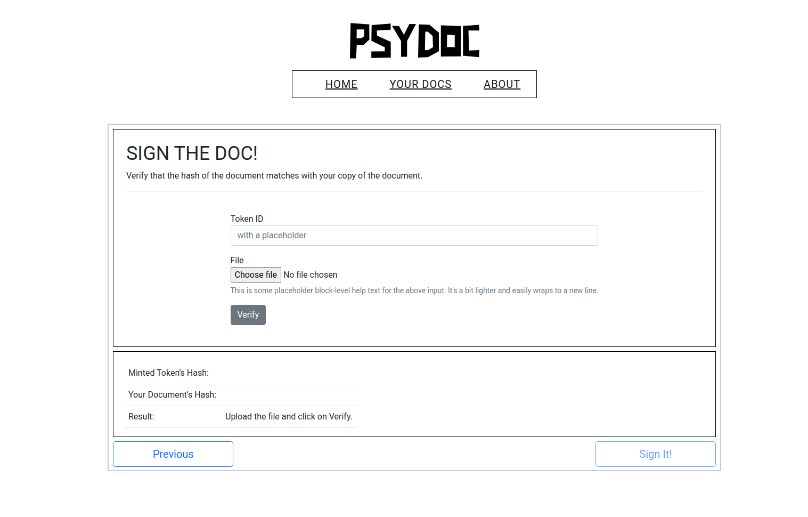
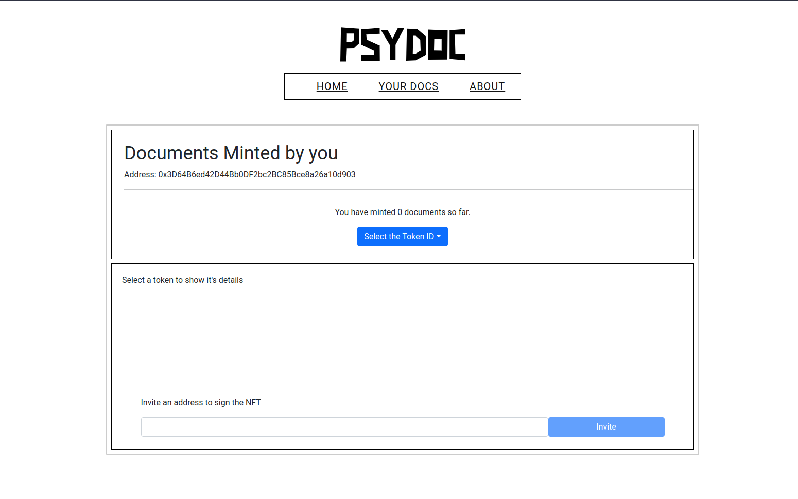

<p align="center">
  <a href="https://psydoc.vercel.app/">
    
  </a>

  <h3 align="center">PSYdoc</h3>

  <p align="center">
    A privacy-preserving electronic-signature protocol on Ethereum
    <br />
    <br />
    <a href="https://psydoc.vercel.app/">View Demo</a>
    ·
    <a href="https://github.com/merkle-groot/PSYdoc/issues">Report Bug</a>
    ·
    <a href="https://github.com/merkle-groot/PSYdoc/issues/issues">Request Feature</a>
  </p>
</p>


<!-- TABLE OF CONTENTS -->
<details open="open">
  <summary>Table of Contents</summary>
  <ol>
    <li>
      <a href="#about-the-project">About The Project</a>
      <ul>
        <li><a href="#built-with">Built With</a></li>
      </ul>
    </li>
    <li>
      <a href="#getting-started">Getting Started</a>
      <ul>
        <li><a href="#prerequisites">Prerequisites</a></li>
        <li><a href="#installation">Installation</a></li>
      </ul>
    </li>
    <li><a href="#usage">Usage</a></li>
    <li><a href="#contracts">Smart Contracts</a></li>
    <li><a href="#contributing">Contributing</a></li>
    <li><a href="#sponsorship">Sponsorships</a></li>
    <li><a href="#license">License</a></li>
  </ol>
</details>


<!-- ABOUT THE PROJECT -->
## About The Project
**Donate** : [Paypal](https://paypal.me/punkster21) | [ko-fi](https://ko-fi.com/punkster21)


*What is PSYdoc?*

PSYdocs allows for **pseudonymous signing of documents** on the Ethereum network. You no longer have to worry about your confidential documents with personal details being stored forever on a central server! With PSYdoc the **document doesn't leave your device!**

*How does it work?*

**Each document is [hashed](https://www.freecodecamp.org/news/what-is-hashing/) locally on your browser** and the resulting hash is sent to the PSYdoc's [smart-contract](https://ethereum.org/en/developers/docs/smart-contracts/), where it is **[minted as an NFT](https://www.reddit.com/r/NFT/comments/kw8tu3/what_are_nfts_how_to_mint_an_nft_why_are_nfts/)**. It has all the features of [ERC-721 standard](http://erc721.org/), which means that it can change hands just like any other **NFT**.

The person who mints the NFT becomes the owner of it and their address is automatically added to the **list of signees**. They in turn can invite other addresses to sign the document/ NFT by **inviting them through the smart-contract**. After an address is invited, they can easily sign the document.

*What problems does it solve?*

1. If the document is tampered with, the hash of the file changes. So, this allows for checking for any foul play on the side of the issuer.
2. The document/NFT remains on the blockchain forever, unless it is burnt.
3. As mentioned above, your file won't be hosted on some central server.

*Is it legal binding?*

Since the user mints/signs the document under their own volition, it can be argued in a court of law that the signature is legally binding. (Not a legal advise)

---
### Built With

* [React](https://getbootstrap.com)
* [Web3](https://web3js.readthedocs.io/)
* [Truffle](https://www.trufflesuite.com/)


---
<!-- GETTING STARTED -->
## Getting Started

To get a local copy up and running follow these steps.
Or if you just want to get a demo of the site, [click here](https://psydoc.vercel.app/)

### Prerequisites

This project requires npm, node & truffle installed.
* npm
  ```sh
  npm install npm@latest -g
  ```
* truffle
  ```
  npm install truffle -g
  ```

---
### Installation

#### a) Compiling and Deploying the contracts
</br>


1. Get <a href="https://infura.io/">Infura API </a>for deploying to the testnets

2. Install the required npm packages
```
cd contracts && npm install
```
2. Create a .env file in /contracts folder
```
touch .env
```
3. Put the mnemonic of you wallet and the above mentioned Infura API to the .env file
```
mnemonic='input your mnemonic here'
urlRopsten='https://ropsten.infura.io/v3/yourAPI'
urlKovan='https://kovan.infura.io/v3/yourAPI'
urlRinkeby='https://rinkeby.infura.io/v3/yourAPI'
urlGorli='https://goerli.infura.io/v3/yourAPI'
urlMumbai='https://polygon-mumbai.infura.io/v3/yourAPI'
```
4. Migrate the contracts to testnets, one by one.
```
truffle migrate --network gorli
truffle migrate --network rinkeby
truffle migrate --network ropsten
truffle migrate --network kovan
truffle migrate --network mumbai
```
---
</br> 

#### b) Running the React app

1. Install the required npm packages
```
cd client && npm install
```
2. Run the React app
```
npm start
```
---
<!-- USAGE EXAMPLES -->
## Usage

### 1. Minting a document as NFT.
* Select the file
* Click on submit
* After it's minted, you can invite people to sign your document by clicking on 'invite' button. (See 3.)
>> P.S 
The minter is by default a signee on the NFT



---
### 2. Signing a document
* Select the TokenID.
* Select the file which you want to sign. (This step is to verify that you are signing the right document)
* Click on 'verify' to see if the hashes match.
* If it's a match, you can go ahead and sign the document.



---
### 3. Invite signees
* Select one of the NFT you have minted.
* Enter the address of the person.
* Click on invite.


---

<!-- CONTRACTS -->
## Contracts
So far, the smart-contracts have been deployed to 
1. Ropsten Network: [0x5c007a1d8051dfda60b3692008b9e10731b67fde](https://ropsten.etherscan.io/address/0x5c007a1d8051dfda60b3692008b9e10731b67fde)

2. Rinkeby Network: [0x6d5556285e263e3375Cf91cD53C0cc6534a74d1F](https://rinkeby.etherscan.io/address/0x6d5556285e263e3375Cf91cD53C0cc6534a74d1F)

3. Gorli Network: [0xf2944e8a6CB7EEeF75F67765f6f0DcE609870C6F](https://goerli.etherscan.io/address/0xf2944e8a6CB7EEeF75F67765f6f0DcE609870C6F#readContract)


<!-- CONTRIBUTING -->
## Contributing

Contributions are what make the open source community such an amazing place to be learn, inspire, and create. Any contributions you make are **greatly appreciated**.

1. Fork the Project
2. Create your Feature Branch (`git checkout -b feature/AmazingFeature`)
3. Commit your Changes (`git commit -m 'Add some AmazingFeature'`)
4. Push to the Branch (`git push origin feature/AmazingFeature`)
5. Open a Pull Request


## Sponsorship

Even though this project will remain open-sourced, you can request new features by sponsoring it. :)
<!-- LICENSE -->
## License

Distributed under the GPL License (aka GNU General Public License v3.0). See `LICENSE` for more information.

